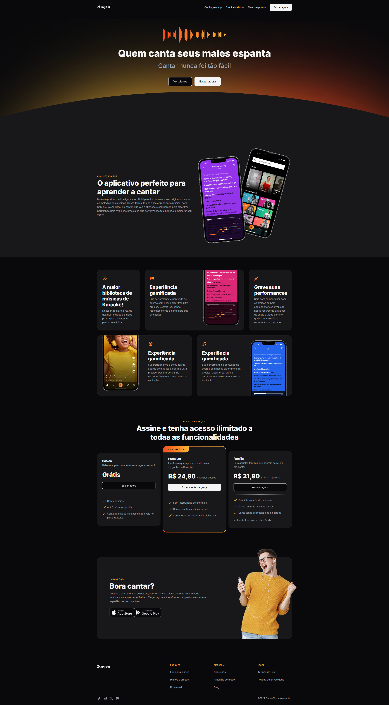

# Landing Page Apicativo - Zingen

Landing Page Apicativo - Zingen é uma página web que demonstra os aprendizados sobre responsividade construída com **HTML** e **CSS**, que utiliza técnicas de **GRID** e **FLEX** para a criação de um layout moderno.

[](https://landpageaplicativo.hallanchristian.com.br)

## Visão Geral

A page possui um design moderno e responsivo.

### Tecnologias Utilizadas

- **HTML5**: Estrutura semântica da página.
- **CSS3**: Estilização e design visual da página.
  - **GRID** e **FLEX**: Usado para alinhar e distribuir os elementos.
  - **Atributos de CSS**: Utilizados para ajustar o espaçamento, estilo de fonte, e outros detalhes visuais e Responsividade.

## Funcionalidades

1. **Conheça o app**:
2. **Funcionalidades**:
3. **Planos e Preços**
4. **Baixar Agora**

## Como Executar o Projeto

1. Clone o repositório:
   ```bash
   git clone https://github.com/hallancma/mba-rockeseat-sirius-projetos-05-projeto-landing-page-de-aplicativo
   ```
2. Abra o arquivo `index.html` em seu navegador para visualizar a página.

## Ver Projeto

Para ver o projeto em funcionamento, você pode visitar o link abaixo:

[Ver Projeto](https://landpageaplicativo.hallanchristian.com.br/)
